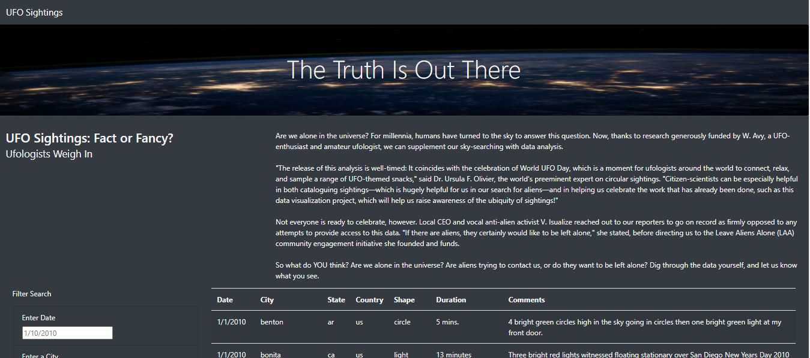
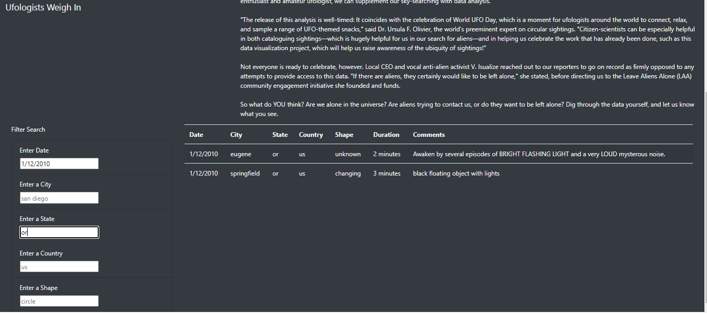
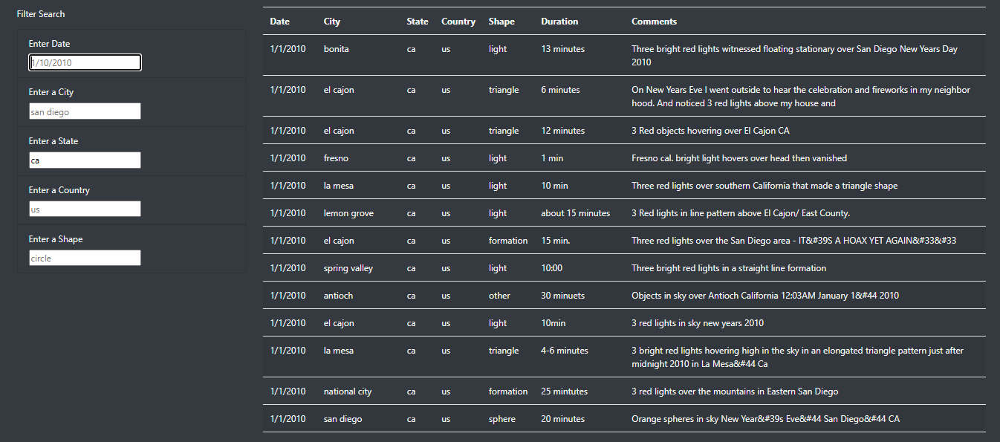

# UFOs

## Overview of Project

The purpose of this project was to create a dynamic webpage using a combination of Javascript and css/html to display a data table about UFO sightings.

## Results

The website allows for users to input 5 separate text filters: date, city, state, country, and shape. After a filter is passed through the text box and the user either clicks on the page or presses enter, the backend JS script reloads the table based on the filter. 

For instance, lets say someone is trying to find reports of a UFO they remember seeing on January 12th, 2010 in Oregon. The user simply inputs and date and state in the forms and they're presented with UFO sightings specific to their query.

## Summary

While this webpage is definitely functional and helpful for those interested in UFO's, there are a few improvements that could be made to increase overall user experience. One drawback of the webpage is the inability to search multiple inputs in one query. While this isn't a huge issue with the current dataset, users might want to be able to search multiple states or cities. One addition that could easily be added to the current webpage would be the ability to search comments for specific remarks concerning a sighting. For instance, the image below shows the table filtered to sightings in CA. Looking at the comments we see multiple reports of red lights. It could be helpful for users to be able to search for keywords to drill down results.

One more recommendation would be to allow users to input a range in the date form. Suppose there is an uptick in UFO sightings in a certain period of time and someone is interested in researching and finding similarities between the sightings. Instead of searching individual dates, the use of ranges would make for a more dynamic querying. 

